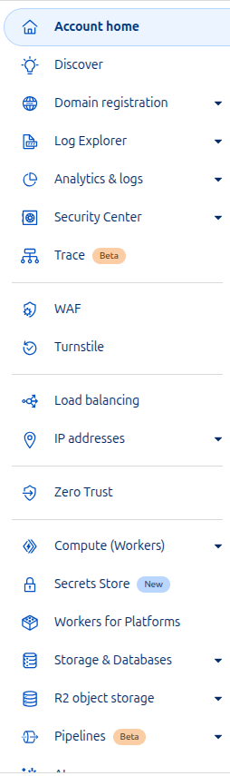
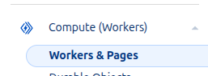
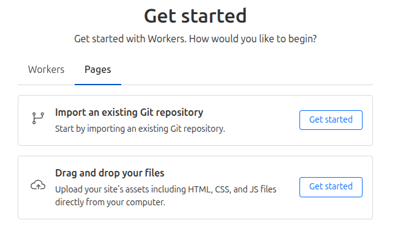

# Intro

Cloudflare's static site offering, also known as Cloudflare pages is an alternative to GitHub pages. I decided to look into it and got a bit carried away

## Why?

Although GitHub pages is free to use (this site is deployed on GitHub pages) unless you are willing to pay for GitHub Pro you must keep you source code public, this is fine for a blog, but is not optimal for other applications.

So if, like me, you want to host a website for absolutely nothing, but not keep the repo public, then pull up a chair...

## Prerequisites

- Create a cloudflare account: https://dash.cloudflare.com/
- Purchase a domain name (Optional)

## The easy way

The easy way is to create your public site bundle (HTML, CSS, JS) in a zip file and upload it manually.

1. When you first create your cloudflare account there is a lot of information to take in



2. We are interested in worker and pages



3. Click on Create Application to create a new Pages application.
4. Make sure to switch to the pages tab (The first time I forgot to do this and ended up creating a worker, im sure this will come up in a later blog post)



5. When you select this option it will ask for a project-name, make sure you name it something awesome because that will become your url (usual URL naming rules apply, so no spaces!). If you named your project `hello-world-123` then your site will be published at `https://hello-world-123.pages.dev`.
6. After thinking of a sick name, then upload your assets and your site will be deployed
7. Optional - Assign your site a proper domain name by using a domain you have imported into cloudflare


## The hard way

The hard way is use Cloudflares [GitHub application](https://developers.cloudflare.com/pages/configuration/git-integration/github-integration/) But im not going to teach you how to do that, personally I could not get it work properly, i leave that as an exercise to the reader. I would recommend the better easy way.

## The better easy way (otherwise known as the hard way)

The better way is to use GitHub actions and the Wrangler cli to deploy the site to cloudflare pages.

The steps are very similar as before, so follow steps 1-5 from before.

6. Submit your project name and click create application.

7. go back to the workers and pages main page and then you can see a blank project in the list.

8. Take note or your cloudflare account (from the url of the page ie: dash.cloudflare.com/123abc/pages/... the ID is 123abc)

9. Take a note of the name you gave your project too.

10. Go to https://dash.cloudflare.com/profile/api-tokens

11. Generate an API token with the `Cloudflare Pages:Edit` scope

12. Take a note of this too...

13. you are now ready for the cool part

14. Crete a github action in you project like so

```yaml
name: Deploy to Cloudflare Pages
on:
  push:
    branches:
      - main

jobs:
  deploy:
    runs-on: ubuntu-latest
    name: Deploy
    permissions:
      contents: read
      deployments: write
    steps:
      - uses: actions/checkout@v4

      - name: Deploy
        uses: cloudflare/wrangler-action@v3
        with:
          apiToken: ${{ secrets.CLOUDFLARE_API_TOKEN }}
          accountId: ${{ secrets.CLOUDFLARE_ACCOUNT_ID }}
          command: pages deploy <assets-dir> --project-name=${{ vars.CLOUDFLARE_PROJECT_NAME }}
          gitHubToken: ${{ secrets.GITHUB_TOKEN }}
```

15. Save the following vars and secrets in your GitHub repository settings:

**Repository Variables:**
- `CLOUDFLARE_PROJECT_NAME`: The project name you created earlier (e.g., `hello-world-123`)

**Repository Secrets:**
- `CLOUDFLARE_API_TOKEN`: The API token you generated in step 11
- `CLOUDFLARE_ACCOUNT_ID`: Your account ID from step 8

17. Push your code to the main branch and watch the magic happen!

## Final thoughts

This setup has been working great for me. Every time I push main, my site gets rebuilt and deployed automatically. No more manual uploads, no more forgetting to build before deploying.

The best part? My source code can stay private while still having automatic deployments. It's like having your cake and eating it too, except the cake is free hosting and you get to keep the recipe secret.

Is it more complicated than just using GitHub Pages? Sure. But sometimes the "hard way" ends up being the better way in the long run.

## Exercise for the reader

Why not also use the Wrangler CLI to create the pages project too? `wrangler pages project create` That way you can automate step 1-6 also!
